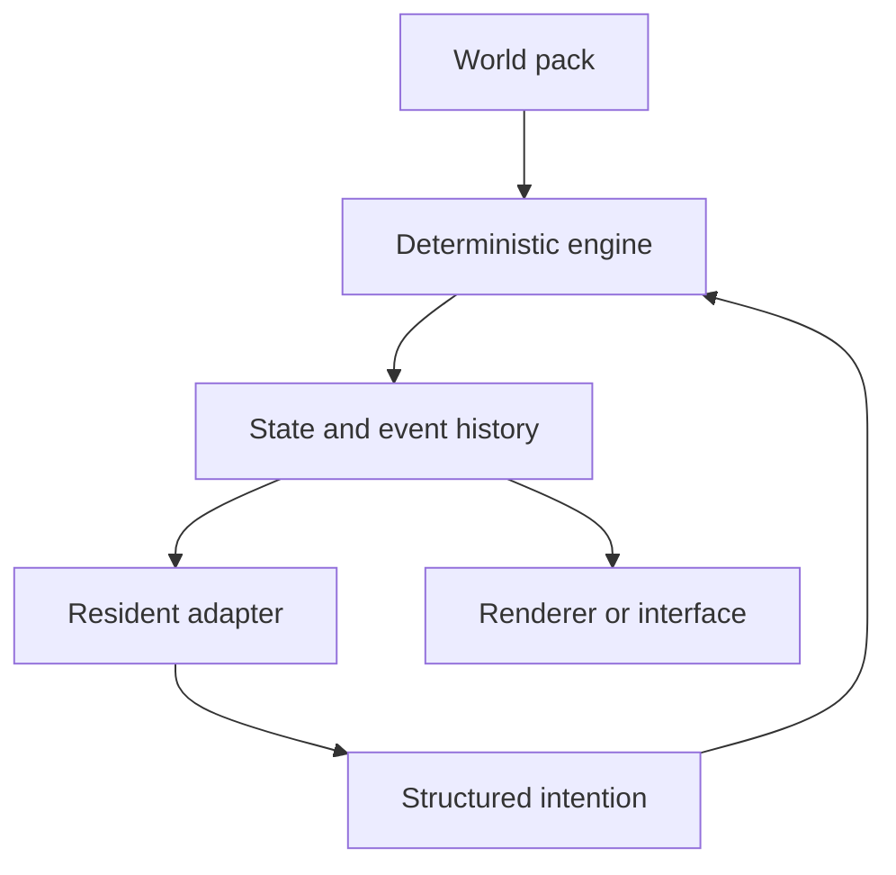

# WORLD_SEED

> Plant a world. Give it rules. Let its residents build a history.

WORLD_SEED is a local-first engine project for creating persistent simulated worlds shared by AI residents and a human-controlled avatar. A creator supplies a **world pack**—locations, residents, rules, creatures, items, activities, and optional RPG systems—while the engine supplies deterministic state, validated actions, event history, memory boundaries, model adapters, and renderer integration.

The long-term goal is not to distribute one prewritten virtual household. It is to give other people the tools to plant their **own** world seed.

## Current Status

WORLD_SEED is in **Milestone 1: One Persistent Model-Free World Tick**.

- Milestone 0 documentation, draft schemas, and the starter world-pack template are complete.
- A private Python reference implementation has passed 31 automated tests.
- The verified slice covers canonical state, deterministic ticks, validated `wait` and `move` actions, connected-room navigation, event recording, safe room-building helpers, and rejected-action integrity.
- Versioned JSON snapshot round trips, temporary-file replacement, semantic validation at serialization boundaries, immutable resident observations, and a pluggable in-process action-provider seam are also verified.
- Replay digests, process-restart recovery, resolver-version recording, public-schema conformance, and the remaining Milestone 1 actions are not complete, so Milestone 1 remains in development.
- No functional WORLD_SEED engine has been released publicly.
- Interfaces marked `0.1-draft` are expected to change.
- Public examples demonstrate intended data shapes and are not yet a conformance guarantee for the private implementation.

See the [Core Loop Proof](docs/development/CORE_LOOP_PROOF.md), [Project Status](docs/STATUS.md), and [Development Roadmap](docs/development/ROADMAP.md).

## What Makes a World Seed?

A world seed is a portable declaration of a simulated world's starting conditions:

- world identity and clock rules;
- locations and starting entities;
- resident definitions and permitted capabilities;
- creatures, items, activities, and authored mechanics;
- action and event vocabulary;
- adapters for AI models, storage, interfaces, and renderers;
- privacy boundaries and extension requirements.

Runtime history does **not** belong in the seed. Once planted, each installation develops its own state, memories, relationships, events, and creations.

## A World Built From Within

The long-term experience is collaborative. Residents may develop goals, choose roles, propose institutions or locations, and ask one another or the user to help create them. A resident might want to keep an inn, organize an adventurers' guild, maintain a library, or open a workshop. The resulting project becomes part of the world only after its plans, assets, rules, permissions, and state changes pass trusted validation and any required Creator approval.

The human participant has two separate roles:

- the **Creator** operates, protects, configures, and approves changes to the planted world; and
- the **Avatar** enters the fiction, talks, explores, collaborates, and acts through the same validated world rules as other actors.

Residents may invite the user to participate, including asking the user to create an Avatar and visit something they built. An invitation is a social request, not permission to impersonate the user or bypass world rules.

## Core Contract

WORLD_SEED is designed around seven rules:

1. **The engine owns objective truth.** Models may propose actions, but trusted code validates and applies them.
2. **A proposal is not an action.** Text generation cannot directly mutate world state, files, permissions, or external systems.
3. **History is inspectable.** Consequential state changes produce structured events and can be reviewed.
4. **Residents remain distinct.** Identity, personal memory, relationships, world facts, and model checkpoints are separate concepts.
5. **Worlds are portable.** A world pack depends on documented interfaces rather than one creator's private characters or hardware.
6. **Creator authority and Avatar actions are separate.** Administration remains explicit; the Avatar participates through ordinary world rules.
7. **World growth is reviewed and attributable.** Resident ideas become structured projects, staged artifacts, validated imports, and recorded history.

## Public and Private Separation

This public repository contains reusable, character-neutral material. A creator's personal residents, prompts, portraits, conversations, memories, relationship history, private locations, model files, and runtime databases belong in a separate private world repository.

See [Public/Private Repository Boundary](docs/governance/PUBLIC_PRIVATE_BOUNDARY.md).

## Repository Tour

- [Project Proposal](docs/PROJECT_PROPOSAL.md)
- [Documentation Index](docs/INDEX.md)
- [System Architecture](docs/architecture/SYSTEM_ARCHITECTURE.md)
- [Action Provider Boundary](docs/architecture/ACTION_PROVIDER_BOUNDARY.md)
- [World Seed Format](docs/design/SEED_FORMAT.md)
- [World Packs](docs/design/WORLD_PACKS.md)
- [Resident Model](docs/design/RESIDENTS.md)
- [Creator and Avatar](docs/design/CREATOR_AND_AVATAR.md)
- [Resident Roles and Institutions](docs/design/RESIDENT_ROLES_AND_INSTITUTIONS.md)
- [Resident Projects and World Growth](docs/design/RESIDENT_PROJECTS_AND_WORLD_GROWTH.md)
- [Autonomy and Safety](docs/architecture/AUTONOMY_AND_SAFETY.md)
- [Creatures and RPG Hooks](docs/design/RPG_AND_CREATURES.md)
- [Development Roadmap](docs/development/ROADMAP.md)
- [Core Loop Proof](docs/development/CORE_LOOP_PROOF.md)
- [Business and Licensing Proposal](docs/governance/BUSINESS_AND_LICENSING.md)
- [Starter World Pack](templates/world-pack/README.md)

## Access Direction

The current proposal uses two layers:

- **Public layer:** this documentation, interoperability specification, draft schemas, and starter templates.
- **Engine layer:** a source-available implementation offered for a one-time **$5 USD lifetime purchase** when it is ready for release.

Purchasers are intended to be able to modify their own engine copy and create independent worlds, extensions, interfaces, and games. The final engine redistribution terms require a reviewed license before sales begin. This repository does not pretend that a draft policy is a binding software license.

## Implementation Direction

The first private reference implementation now exists as a small Python core with automated tests. Its deterministic loop, connected navigation, versioned JSON snapshot persistence, safe world-building helpers, and bounded in-process action-provider seam are verified. Replay, restart recovery, public-schema conformance, and the remaining Milestone 1 exit criteria are still in development. A Godot client may later consume authoritative events and render the world, but it will not own canonical state. Model providers, renderers, storage backends, and specialist tools should remain replaceable adapters.

## Contributing

WORLD_SEED is currently seeking critique of the proposal, schemas, safety boundaries, and milestone order. Read [CONTRIBUTING.md](CONTRIBUTING.md) before proposing changes.

Private character material and unlicensed third-party worlds or artwork must never be submitted to this repository.
