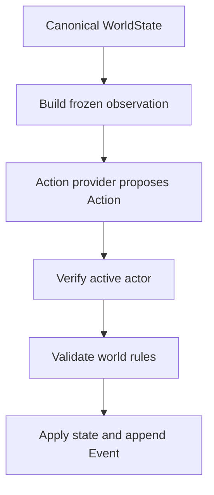

# Action Provider Boundary

**Status:** Verified private-reference precursor

**Evidence date:** 2026-09-03

**Public implementation:** Not yet available

## Purpose

WORLD_SEED separates deciding from doing. A resident policy, future local-model adapter, or future human-input adapter may propose an action, but only trusted engine code may validate and apply it to canonical state.

The private Python reference implementation now verifies the first model-free seam for that separation: an optional in-process callable receives a frozen resident observation and returns an `Action` object.

## Verified Reference Contract

For each resident in deterministic turn order, the current reference slice can:

1. validate canonical world references;
2. build a point-in-time observation for the active resident;
3. call an injected action provider with that observation;
4. receive a structured action from the tested provider;
5. reject an action attributed to anyone other than the active resident;
6. run the action through the ordinary world and action validators;
7. apply an accepted `wait` or connected `move` action; and
8. append the resulting canonical event.

If no external provider is supplied, the deterministic placeholder policy continues to propose `wait`.



## Minimal Resident Observation

The verified observation currently contains:

| Field | Meaning |
| --- | --- |
| `tick` | Canonical tick observed for this decision |
| `actor_id` | Stable ID of the resident whose turn is active |
| `actor_name` | Current display name for the active resident |
| `location_id` | Stable ID of the resident's current room |
| `location_name` | Current display name of that room |
| `available_exit_ids` | Immutable tuple of directly connected room IDs |

The provider is not passed canonical `WorldState` through this contract. The exit collection is copied from the room's mutable list into an immutable tuple before the provider sees it.

This is a minimal navigation observation, not the final perception schema. It does not yet contain visible entities, private memory, relationship beliefs, permitted action schemas, prior-action results, needs, inventory, timeouts, or hidden-state filtering rules.

## Provider Shape

Conceptually, the verified callable has this shape:

```text
ResidentObservation -> Action
```

The provider may be replaced without changing the transition code. That same seam is intended to support several future controller types:

| Controller | Current status | Required translation |
| --- | --- | --- |
| Deterministic placeholder | Verified | Resident state to `wait` action |
| In-process scripted provider | Verified | Observation to structured action |
| Local language-model adapter | Planned | Observation and bounded context to parsed action |
| Human Avatar input adapter | Planned | User input to structured action |

A future model response may begin as constrained JSON or another transport representation. An adapter must parse and validate that response into an action object. Free-form model text must never be treated as a state mutation.

## Actor-Binding Guard

One provider call represents permission to propose an action for one active resident. If the returned `actor_id` differs from that resident's ID, the engine rejects it before action application.

This guard prevents a controller invoked for one resident from using that turn to impersonate another resident. It does not replace ordinary action validation: the destination, action kind, current location, room connection, permissions, and later rule preconditions still require independent checks.

The same principle will apply to the user's Avatar. Avatar input may propose actions for the Avatar; it cannot silently become Creator administration or act as another resident.

## Security Boundary and Limits

The observation interface follows least privilege, but the current provider is an in-process Python callable, not a security sandbox. Code already running inside the engine process could still misuse ambient references, imports, or operating-system permissions if it were trusted and installed carelessly. Future external or third-party adapters require process isolation, capability policy, timeouts, and explicit transport contracts.

The verified slice does **not** yet prove:

- language-model inference or model-host communication;
- malformed free-text or JSON model-response handling;
- dedicated acceptance coverage for a provider returning a non-`Action` Python object;
- timeout, cancellation, retry, health-check, or fallback behavior;
- per-resident provider registration;
- private memory or relationship-context isolation;
- Avatar controls or Creator controls;
- full observation authorization and visibility filtering;
- rollback of earlier residents if a later provider fails during the same tick;
- public-schema conformance or public reproducibility.

## Evidence

The private reference tests prove that a custom provider can inspect the expected navigation observation and move its active resident, while a provider action attributed to a different resident is rejected without advancing the tested single-resident world.

See [Core Loop Proof](../development/CORE_LOOP_PROOF.md) for the complete 31-test evidence manifest and its limitations.
