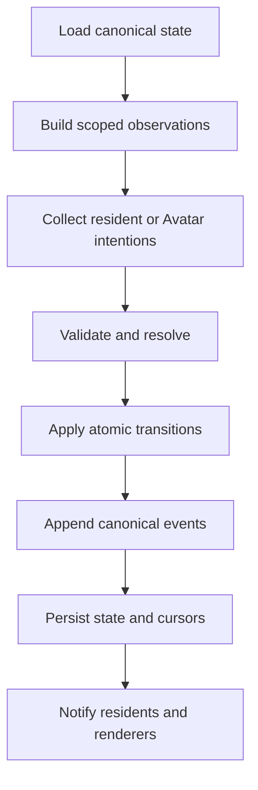

# System Architecture

## Architectural Goal

WORLD_SEED separates imaginative model behavior from authoritative simulation behavior. Models supply possible intentions and interpretations. Deterministic modules decide what is valid, update the world, and record the result.

## Major Components

| Component | Responsibility | Must Not Do |
| --- | --- | --- |
| Seed loader | Validate and resolve a world pack | Execute arbitrary pack code during parsing |
| State store | Hold canonical world state | Treat model text as a state update |
| Clock and scheduler | Advance configured simulation time | Invent unrecorded time jumps |
| Observation builder | Create truthful, resident-scoped observations | Leak private memory or hidden state |
| Resident policy | Propose a structured intention | Apply the action itself |
| Human input adapter | Translate Avatar input into a structured intention | Treat direct input as an automatic state change |
| Action validator | Check schema, permissions, preconditions, and limits | Ask the model whether its own action is valid |
| Rule resolver | Calculate deterministic outcomes and recorded randomness | Hide rule or random inputs |
| Transition service | Apply an accepted outcome atomically | Partially mutate state on failure |
| Event log | Append canonical results and provenance | Rewrite history silently |
| Memory service | Build private and shared interpretations from events | Replace objective events with beliefs |
| Project service | Track proposals, requirements, collaborators, staged work, and status | Import generated work directly into canonical state |
| Creator console | Expose explicit administration, approval, inspection, and recovery controls | Disguise administrator operations as Avatar actions |
| Adapter registry | Connect approved model, renderer, storage, and tool adapters | Grant adapters undeclared authority |

## Tick Pipeline



Each step has explicit inputs and outputs. A failure before `Apply` leaves canonical state unchanged. A failure after `Apply` must be recoverable from transactional storage or event replay.

## Verified Private Reference Slice

The current private Python reference implementation verifies a deliberately smaller form of this architecture:

- canonical `WorldState` stores ticks, rooms, room exits, residents, and canonical events;
- deterministic ticks process resident IDs in sorted order;
- `wait` and connected `move` proposals pass through world and action validation before application;
- rejected movement cannot use a missing or unconnected destination;
- accepted actions append canonical events;
- safe builder helpers add uniquely identified rooms and create idempotent two-way connections;
- versioned JSON snapshot serialization and filesystem round trips preserve current state and history;
- serialization boundaries reuse semantic world validation;
- an optional in-process action provider receives a frozen resident observation rather than canonical state;
- a provider response must be attributed to the resident whose decision was requested.

This verified slice does not yet provide whole-tick rollback, replay digests, resolver-version records, public-schema conformance, model-host adapters, Avatar input, or a renderer. See [Core Loop Proof](../development/CORE_LOOP_PROOF.md) and [Action Provider Boundary](ACTION_PROVIDER_BOUNDARY.md).

## Proposed Core Package Boundaries

```text
world_seed/
  seed/          manifest loading and schema validation
  world/         state models, clock, scheduler, and queries
  actions/       proposals, permissions, validators, and resolvers
  events/        canonical events, append log, and replay
  actors/        shared actor contracts and human Avatar input
  residents/     observations, policies, and resident adapters
  memory/        private memory interfaces and relationship beliefs
  projects/      proposals, collaboration, staging, approval, and import
  adapters/      model, renderer, storage, specialist, and tool ports
  cli/           validation, planting, running, inspecting, and migration
```

This layout is a direction, not implemented code.

## State and Event Strategy

The reference implementation should begin with a snapshot plus append-only event log:

- state snapshots make startup simple;
- events explain how state changed;
- snapshot metadata records the last included event;
- replay validates recovery and migrations;
- seeded randomness and resolver versions make outcomes auditable.

An event-sourced database may be considered later, but the first milestone should not require distributed infrastructure.

## Concurrency Direction

The first engine processes intentions serially in a deterministic order. Later concurrency may collect proposals in parallel, but commits must resolve against a known state revision. Conflicting actions are rejected, reordered by an authored rule, or resolved as a transaction—never applied unpredictably.

## Adapter Boundary

Adapters receive the minimum data required for their role. A renderer receives presentation-safe state and events. A model receives a scoped observation and approved memory context. A specialist receives a bounded task. A storage backend receives serialized records.

No adapter gains authority merely because it can return convincing text or code.

## Creator and Avatar Boundary

The human user reaches the engine through two separate control paths:

- **Creator controls** perform explicit administration such as planting, pausing, configuration, approval, backup, restore, and migration.
- **Avatar input** proposes ordinary in-world actions such as speaking, moving, using an object, or joining a project.

Avatar intentions use the same validation and resolution pipeline as resident intentions. Creator operations use a separate trusted interface with administrative provenance. Resident dialogue cannot invoke Creator controls, and Creator intervention must not be rewritten as an action the Avatar supposedly performed.

See [Creator and Avatar](../design/CREATOR_AND_AVATAR.md).

## Project and Import Boundary

Resident-led growth is represented by project state rather than by allowing models to edit the running world. A project service tracks goals, collaborators, requirements, staged artifacts, validations, approvals, and linked events. Trusted import code may create or update declared world entities only after required checks succeed.

Simulated construction and real content development remain distinct. World actions can consume simulated time and resources; external writing, images, rules, or code remain staged until reviewed. See [Resident Projects and World Growth](../design/RESIDENT_PROJECTS_AND_WORLD_GROWTH.md).

## Portability Boundary

World packs use JSON/YAML data and versioned identifiers. Engine-specific code extensions, when eventually supported, must declare compatibility and run behind an explicit trust policy. A basic world should remain expressible without executable pack code.

## Scaling Direction

Scale along independent axes:

- number of active residents;
- simulation frequency;
- world detail and entity count;
- model size and inference frequency;
- memory retrieval depth;
- renderer complexity;
- background scheduling.

Creators can increase one axis as hardware improves without replacing the whole system.
