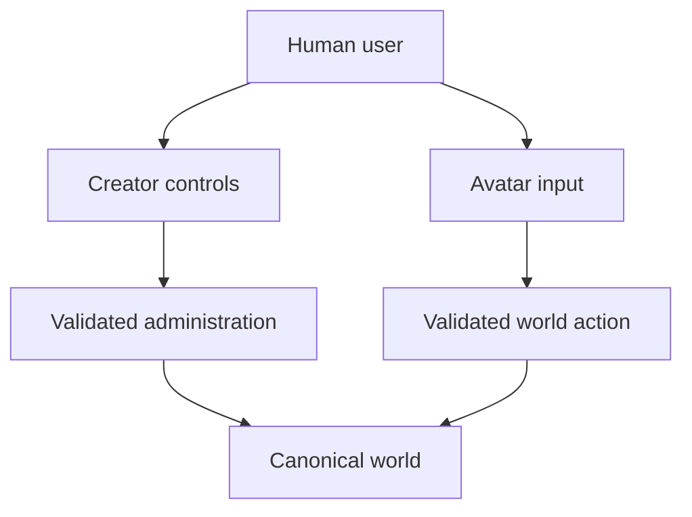

# Creator and Avatar

**Direction status:** Accepted design direction  
**Implementation status:** Planned

## Purpose

WORLD_SEED gives the human participant two deliberately separate ways to interact with a planted world:

- the **Creator** manages the installation from outside the fiction; and
- the **Avatar** participates from inside the fiction.

Keeping these roles separate allows a person to maintain and protect the simulation without turning every in-world action into an unexplained administrator command.

## The Creator Role

The Creator is the owner and operator of a planted world. Creator controls may include:

- planting, pausing, resuming, backing up, restoring, and migrating a world;
- inspecting canonical state, events, diagnostics, and resident-visible information;
- approving or rejecting proposed additions;
- configuring models, adapters, permissions, schedules, and resource limits;
- correcting or deleting private memory through an inspectable process;
- supplying original writing, artwork, rules, locations, or other project resources;
- stopping unsafe, broken, or unwanted behavior.

Creator authority belongs to trusted application code. It is never granted merely because a resident or model asks for it.

Consequential Creator operations should be recorded as administrative provenance. They must not be disguised as ordinary avatar actions or resident decisions.

## The Avatar Role

The Avatar is the user's embodied participant in the world. It is controlled by human input rather than by an autonomous resident policy.

An avatar may eventually:

- occupy and travel between locations;
- speak with residents;
- use objects and participate in activities;
- accept or decline invitations, work, quests, and collaborative projects;
- own or carry permitted items;
- explore, build relationships, and take part in optional RPG systems;
- contribute in-world labor or decisions to approved construction and institutions.

The Avatar uses the same proposal, validation, resolution, and event pipeline as other in-world actors. Human control does not allow an impossible move, free item creation, fabricated combat result, or undeclared state change.

## Two Control Paths

The interface must clearly show which path is active. A command such as restoring a save belongs to Creator controls. A command such as entering an inn belongs to the Avatar action system.

## Actor Contract

Residents and avatars share an in-world action contract but are not the same kind of controller:

| Concern | Resident | Avatar |
| --- | --- | --- |
| Decision source | Deterministic or model-backed resident policy | Direct human input |
| Action authority | Declared capabilities and permissions | Declared capabilities and permissions |
| Canonical result | Deterministic engine resolution | Deterministic engine resolution |
| Personal memory | Resident-scoped memory | Creator-selected avatar history and notes |
| Administrative authority | None by default | None while acting as the Avatar |

A later actor schema may represent their shared fields. The `0.1-draft` resident schema should not be stretched prematurely to settle that implementation.

## Invitations and Presence

Residents may notice whether the Avatar is present, invite the user to participate, request help, or ask the Avatar to visit a location. An invitation is a social proposal, not a forced transition or permission grant.

The user always chooses whether to enter Avatar mode, accept an invitation, or perform an action. If the user is absent, the world follows its configured pause or background-simulation policy.

Presence must be represented truthfully. A resident should not be told that the Avatar heard, saw, promised, or completed something unless the corresponding interaction occurred.

## Initial Slice

The first Avatar proof should be intentionally small:

1. the user enters one existing location through a terminal interface;
2. the Avatar receives a presentation-safe observation;
3. the user selects one declared action;
4. the engine validates and resolves it through the normal action pipeline;
5. a canonical event records the result; and
6. save and reload preserve the Avatar's location and the event.

This proof requires no 2D or 3D renderer. Godot can later translate the same observations and events into movement, animation, dialogue, and interaction prompts.

## Safety and Privacy Requirements

- Avatar input is untrusted input and must be validated.
- Resident dialogue cannot switch the user into Creator mode.
- Creator credentials and private configuration never enter resident observations.
- A resident cannot impersonate the Avatar or claim an absent user performed an action.
- Creator intervention should remain distinguishable from world history.
- Multiple human users, networking, and multiplayer authority are outside the first implementation.

## Long-Term Acceptance Direction

The design is successful when a resident can truthfully invite the user into an established place, the user can enter through an Avatar, both can interact through the same world rules, and the resulting shared history survives restart without confusing Avatar actions with Creator administration.
