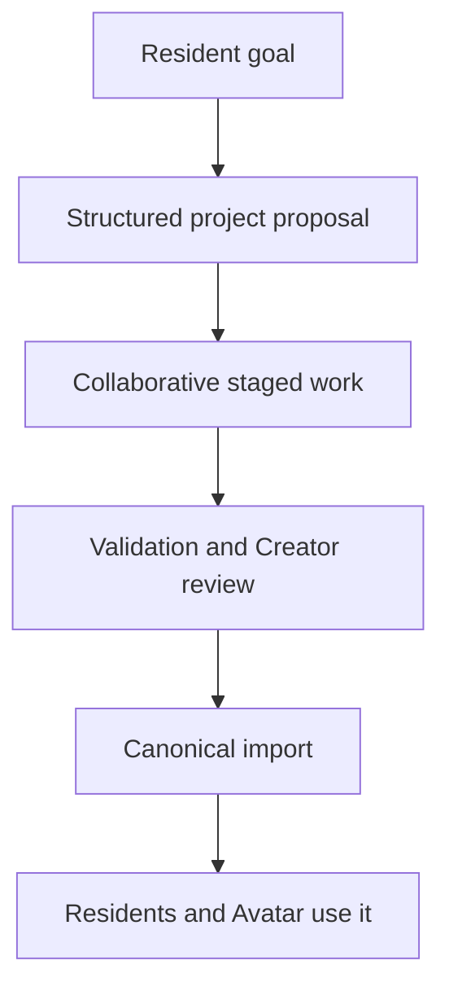

# Resident Projects and World Growth

**Direction status:** Accepted design direction  
**Implementation status:** Planned

## Purpose

WORLD_SEED is intended to let residents help shape the world they inhabit. A resident may want a new home, inn, guild, garden, trail, story collection, creature study, workshop, or game. Residents can propose these goals, collaborate with one another and the user, and eventually experience approved results through the same persistent simulation.

This is **resident-led co-creation**, not unrestricted self-modification. The model contributes intention, judgment, writing, planning, or creative candidates. Trusted code and Creator review decide what becomes canonical.

## Project Lifecycle

An initial lifecycle is:

1. **Goal** — a resident or the user identifies a desired change.
2. **Proposal** — the proposer describes the outcome, motivation, scope, requirements, and unknowns.
3. **Planning** — the project is divided into finite simulated and real development work.
4. **Collaboration** — residents and the user contribute according to declared capabilities.
5. **Staging** — generated or authored artifacts remain outside canonical state.
6. **Validation** — schemas, rules, permissions, paths, dependencies, and tests are checked.
7. **Approval** — the Creator accepts, revises, or rejects consequential imports.
8. **Construction or import** — trusted code applies validated steps and records provenance.
9. **Use** — residents and the Avatar can experience the result.
10. **History** — success, failure, contribution, and later modification remain inspectable.

## Project Record

A project may eventually contain:

- stable project identifier and version;
- proposer and collaborators;
- objective and motivation;
- planned deliverables;
- current status;
- required world resources and real development inputs;
- blocked questions or unavailable capabilities;
- staged artifact references and provenance;
- validation results and approvals;
- linked construction, import, completion, or failure events;
- resulting locations, objects, rules, roles, or institutions.

Free-form conversation may inspire a project, but the structured project record is what makes it resumable and auditable.

## Types of Work

Resident projects may combine several kinds of contribution:

| Work type | Example | Canonical boundary |
| --- | --- | --- |
| Planning | Room requirements or project sequence | Plan remains advisory until accepted |
| Writing | Description, dialogue, lore, or quest draft | Text enters the world only through review/import |
| Visual design | Concept art, signs, clothing, or location mockups | Generated files remain staged with provenance |
| Simulation work | Gathering resources or constructing an authored object | Each step resolves through world rules |
| Rules and data | Service, activity, role, item, or encounter definitions | Schema and conformance checks precede import |
| Programming | Proposed extension or tool code | Sandboxed tests and explicit approval are mandatory |

## Asking the User for Help

Residents should be able to recognize missing capabilities and ask plainly for assistance. A request such as “Could you make an Avatar and visit the inn with us?” is a social invitation. A request such as “We need a room layout and an interaction rule before this can open” is a grounded project dependency.

The engine must not pretend the user agreed, created an asset, installed a model, or completed work until that input actually exists.

## Collaboration Between Residents

Different residents may contribute different strengths without becoming fixed utility roles. One might enjoy writing, another visual design, and another systems planning. Collaboration should record:

- who proposed each contribution;
- which context and tools were provided;
- which output was generated or authored;
- who reviewed or revised it;
- why it was accepted or rejected; and
- which canonical entity, if any, resulted.

A specialist model is a bounded capability used by a resident. It does not become an untracked fourth participant and does not gain the resident's identity or permissions.

## Simulated Construction and Engine Development

WORLD_SEED must distinguish two layers:

- **simulated construction** uses existing world rules, time, resources, and actions to change canonical world state; and
- **engine or content development** creates definitions, art, code, or adapters outside the running world.

A resident may participate in both through approved workflows, but gathering simulated timber cannot silently create a Python module, and generating an image cannot silently create a traversable location.

## Example: Building and Opening an Inn

1. A resident proposes an inn and a desired innkeeper role.
2. The project identifies the smallest usable version: one room, one service, a schedule, and an interaction rule.
3. Collaborators draft the description, concept art, required objects, and data definitions.
4. The user supplies or revises missing material.
5. Trusted validators check the staged world-pack extension.
6. The Creator approves import.
7. Construction or initialization events create the location and institution.
8. The resident accepts the innkeeper role.
9. The resident invites the user's Avatar.
10. The Avatar visits and interacts through validated actions.

The completed inn carries provenance connecting it to its proposal, contributors, approval, and construction history.

## Failure and Revision

Projects may be paused, rejected, abandoned, superseded, or completed with reduced scope. Failure should preserve useful plans and explanations without forcing the world to accept an invalid artifact.

Residents may disagree about a project. The engine records objective status and contributions; each resident may retain a different private interpretation of what happened.

## Long-Term Acceptance Direction

This design is successful when a resident can propose one small original location or institution, collaborate with another resident and the user, identify missing inputs honestly, pass validation and approval, activate a role, and later invite the user's Avatar to experience the result—with every consequential step inspectable and reversible where practical.
