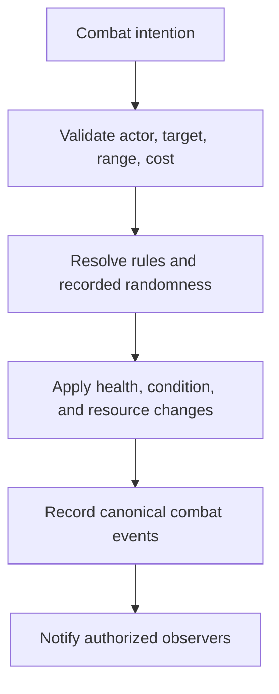

# RPG Systems, Creatures, Combat, and Hunting

## Optional by Design

WORLD_SEED should support peaceful social worlds, dangerous adventure worlds, and mixtures of both. RPG mechanics are extension modules layered on the same action-validation and event contracts; they are not mandatory engine assumptions.

## Creature Model

A creature definition may declare:

- stable species/template identifier;
- habitats and spawn rules;
- deterministic or adapter-backed behavior policy;
- perception and movement limits;
- disposition and social tags;
- statistics, resistances, and abilities;
- resources, drops, or ecological effects;
- interaction, taming, hunting, and combat rules;
- renderer-facing asset references.

Creatures do not need language models. Simple authored behavior should remain the default for scale and predictability.

## RPG Extension Boundary

An RPG ruleset may add:

- attributes and derived statistics;
- skills, abilities, equipment, and conditions;
- turn, cooldown, stamina, mana, or action-cost systems;
- combat and damage resolution;
- hunting, gathering, crafting, and resource loops;
- quests, encounters, rewards, and progression;
- seeded random tables with recorded outcomes.

The extension registers schemas and deterministic resolvers with the engine. Models choose among allowed actions; they do not calculate or declare final outcomes.

## Combat Flow

Free-form narration may describe the event afterward, but cannot change damage, range, inventory, defeat, or rewards.

## Hunting Flow

Hunting should be a composed activity rather than a single magical result. A world may model:

1. preparation and equipment;
2. travel to an allowed habitat;
3. tracks or evidence generated by rules;
4. detection and approach;
5. pursuit, avoidance, capture, or combat;
6. resource collection and carrying limits;
7. ecological or social consequences;
8. return, use, trade, or storage.

Each step creates inspectable state changes. Worlds may replace lethal hunting with photography, tagging, gathering, or creature rescue.

## Safety and Tone Controls

World packs should declare content tags and configurable presentation detail. Mechanical events remain structured even if a renderer suppresses graphic description. Resident models should receive the level of detail appropriate to the world's authored tone and creator settings.

## Ecological Persistence

Creature populations and resources should eventually respond to time, habitat, predation, hunting pressure, replenishment, and authored limits. Early milestones use fixed spawns or small deterministic populations before attempting complex ecology.

## Development Order

1. items and resource quantities;
2. simple creature entities and movement;
3. interaction and avoidance;
4. statistics and deterministic contests;
5. combat and conditions;
6. hunting and gathering activities;
7. quests and progression;
8. persistent ecology.

This work begins only after core state, events, saving, and resident action validation are verified.
